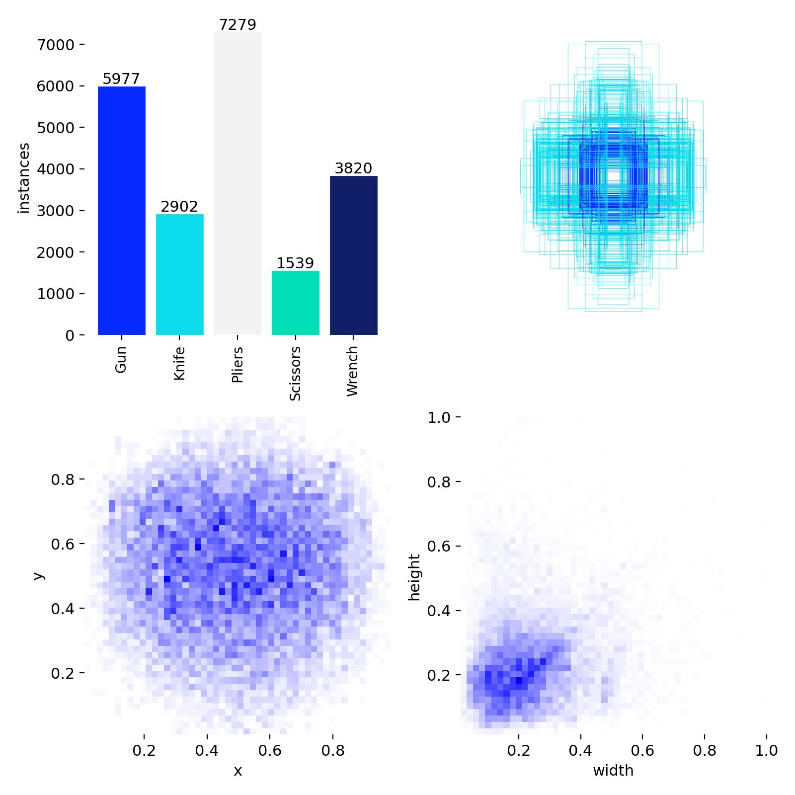
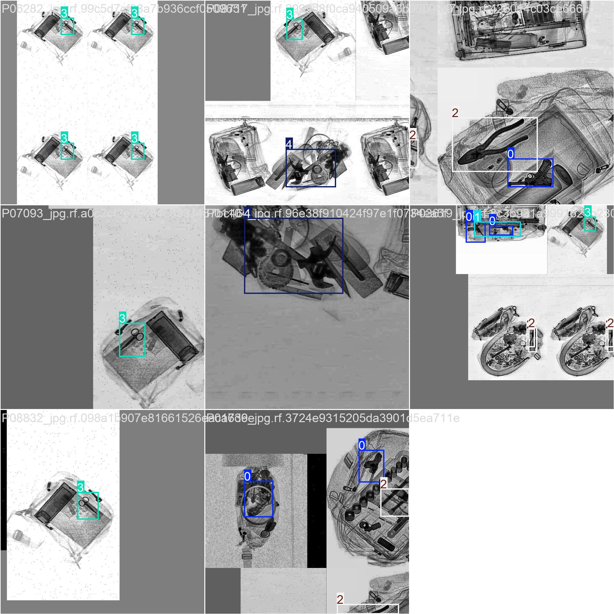
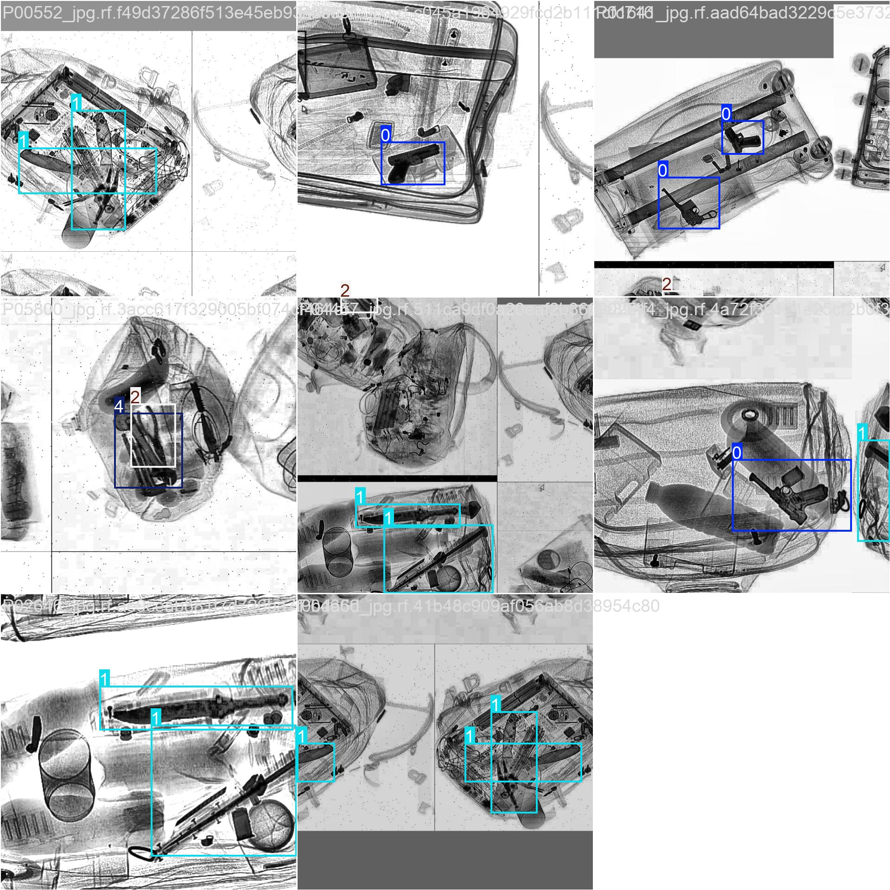
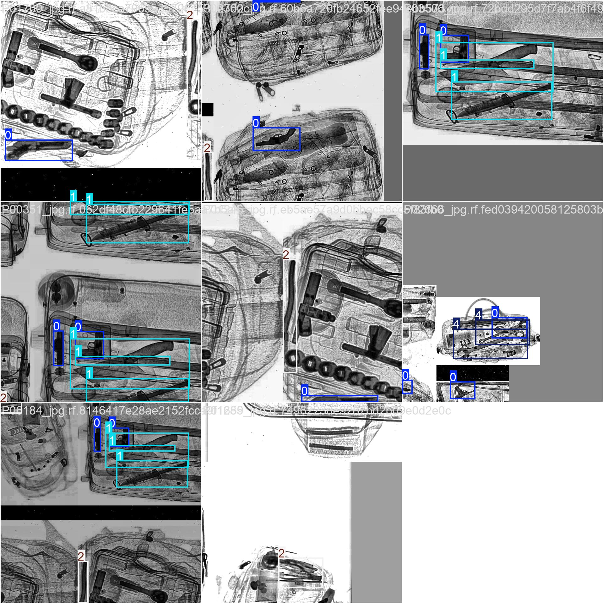
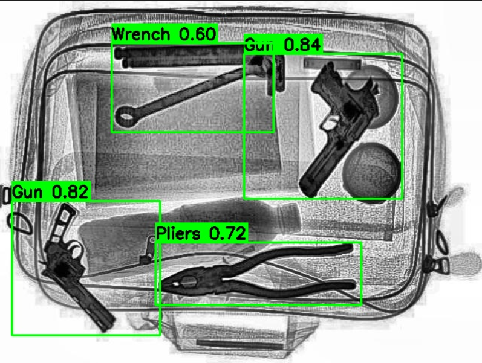

# Security_CAM

## Overview

Security_CAM is an AI-powered real-time security monitoring system built using YOLO object detection and OpenCV.

The project is capable of detecting and classifying security-related objects from webcam feeds and images using a custom-trained YOLO model. It demonstrates the complete machine learning workflow including dataset preparation, model training, validation, and real-time inference.

---

## Key Features

- Real-time webcam object detection
- Custom-trained YOLO model
- Live bounding box visualization
- Confidence score filtering
- Image-based detection
- Custom dataset training pipeline
- Security-oriented object recognition

---

## Technology Stack

| Component | Technology |
|------------|------------|
| Programming Language | Python |
| Computer Vision | OpenCV |
| Deep Learning | YOLO |
| Dataset Annotation | Roboflow |
| Data Processing | NumPy |
| Training Framework | Ultralytics YOLO |

---

## Project Structure

```text
Security_CAM/
│
├── train/
├── valid/
├── test/
│
├── runs/
│
├── detect_cam.py
├── detect_image.py
├── train_model.py
├── data.yaml
│
├── README.dataset.txt
├── README.roboflow.txt
│
├── yolo11n.pt
├── yolo26n.pt
│
├── screenshots/
│   ├── labels.jpg
│   ├── train_batch0.jpg
│   ├── train_batch1.jpg
│   ├── train_batch2.jpg
│
└── README.md
```

---

## Dataset Classes

The custom dataset contains the following object classes:

| Class |
|---------|
| Gun |
| Knife |
| Pliers |
| Scissors |
| Wrench |

---

## Installation

### Clone Repository

```bash
git clone https://github.com/HarshuPandhare/Security_CAM.git
cd Security_CAM
```

### Create Virtual Environment

```bash
python -m venv venv
```

### Activate Virtual Environment

Windows:

```bash
venv\Scripts\activate
```

Linux/macOS:

```bash
source venv/bin/activate
```

### Install Dependencies

```bash
pip install -r requirements.txt
```

---

## Model Training

Run:

```bash
python train_model.py
```

Training results will be stored inside:

```text
runs/
```

---

## Webcam Detection

Run:

```bash
python detect_cam.py
```

The system will:

1. Access the webcam
2. Load the trained model
3. Detect objects in real time
4. Display labels and confidence scores
5. Draw bounding boxes around detected objects

---

## Image Detection

Run:

```bash
python detect_image.py
```

---

# Training Dataset Analysis

The following image shows the class distribution and annotation statistics of the training dataset.



---

# Training Batch Samples

The following images show annotated training batches generated during YOLO training.

| Training Batch 0 | Training Batch 1 |
|------------------|------------------|
|  |  |

| Training Batch 2 |
|------------------|
|  |

---


# Detection Results

Add screenshots of your real-time detections here.

```text
screenshots/detection_output.jpg
```

Example:



---

## Workflow

```text
Dataset Collection
        
        ▼
Data Annotation
        │
        ▼
Dataset Preparation
        │
        ▼
YOLO Training
        │
        ▼
Model Validation
        │
        ▼
Real-Time Detection
        │
        ▼
Security Monitoring
```

---

## Future Improvements

- Intrusion detection alerts
- Email notifications
- Mobile notifications
- Face recognition integration
- Multi-camera support
- Cloud deployment
- Event logging and reporting
- Smart surveillance dashboard

---

## Learning Outcomes

This project demonstrates:

- Computer Vision fundamentals
- Object Detection using YOLO
- Dataset preparation and annotation
- Real-time video processing
- Deep Learning model training
- AI-based security applications

---

## Author

Harshvardhan Pandhare

GitHub: https://github.com/HarshuPandhare

---

## Repository

https://github.com/HarshuPandhare/Security_CAM

---

## License

This project is intended for educational, research, and learning purposes.
